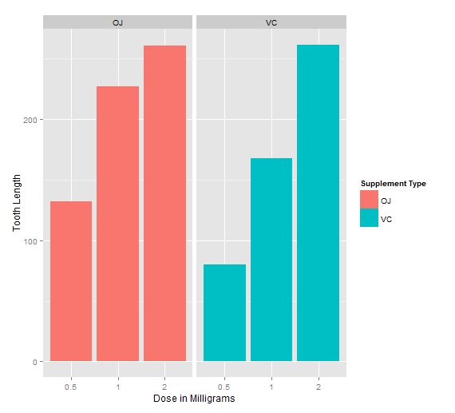

# Statistical Inference Course Project , Part:2- Basic Inferential Data Analysis

In the second part of the project, we analyze the **ToothGrowth** data in the R datasets package. The data is set of 60 observations, length of odontoblasts (teeth) in each of 10 guinea pigs at each of three dose levels of Vitamin C (0.5, 1 and 2 mg) with each of two delivery methods (Orange Juice or Ascorbic Acid).

<pre>
## Load necesary packages
library(datasets)
library(ggplot2)
</pre>

<pre>
## Load the data
ggplot(<code>data</code>=ToothGrowth, aes(x=as.factor(dose), y=len, <code>fill</code>=supp)) +
  geom_bar(stat="identity",) +
  facet_grid(. ~ supp) +
  xlab("Dose in Milligrams") +
  ylab("Tooth Length") +
  guides(<code>fill</code>=guide_legend(title="Supplement Type"))

</pre>

As can be seen above, there is a clear positive correlation between the tooth length and the dose levels of Vitamin C, for both delivery methods.

The effect of the dose can also be identified using regression analysis. One interesting question that can also be addressed is whether the supplement type **(i.e. Orange Juice or Ascorbic Acid)** has any effect on the tooth length. In other words, how much of the variance in tooth length, if any, can be explained by the supplement type?

<pre>
fit <- lm(len ~ Dose + Supp, <code>data</code>=ToothGrowth)
summary(fit)
</pre>

<pre>
## 
Call:
lm(formula = len ~ Dose + Supp, data = ToothGrowth)

Residuals:
   Min     1Q Median     3Q    Max 
-6.600 -3.700  0.373  2.116  8.800 

Coefficients:
            Estimate Std. Error t value Pr(>|t|)    
(Intercept)   9.2725     1.2824   7.231 1.31e-09 ***
Dose          9.7636     0.8768  11.135 6.31e-16 ***
SuppVC       -3.7000     1.0936  -3.383   0.0013 ** 
---
Signif. codes:  0 ‘***’ 0.001 ‘**’ 0.01 ‘*’ 0.05 ‘.’ 0.1 ‘ ’ 1

Residual standard error: 4.236 on 57 degrees of freedom
Multiple R-squared:  0.7038,	Adjusted R-squared:  0.6934 
F-statistic: 67.72 on 2 and 57 DF,  p-value: 8.716e-16
</pre>

The model explains 70% of the variance in the data. The intercept is <code>r fit$coefficients[[1]]</code>, meaning that with no supplement of Vitamin C, the average tooth length is<code>r fit$coefficients[[1]]</code> units. The coefficient of dose is <code>r fit$coefficients[[2]]</code>. It can be interpreted as increasing the delivered dose 1 mg, all else equal (i.e. no change in the supplement type), would increase the tooth length <code>r fit$coefficients[[2]]</code> units. The last coefficient is for the supplement type. Since the supplement type is a categorical variable, dummy variables are used. The computed coefficient is for **SuppVC** and the value is r fit$coefficients[[3]] meaning that delivering a given dose as **Ascorbic Acid**, without changing the dose, would result in <code>r abs(fit$coefficients[[3]])</code> units of decrease in the tooth length. Since there are only two categories, we can also conclude that on average, delivering the dosage as orange juice would increase the tooth length by <code>r abs(fit$coefficients[[3]])</code>

 95% confidence intervals for two variables and the intercept are as follows.
<pre>
confint(fit)
</pre>

<pre>
##               2.5 %    97.5 %
(Intercept)  6.704608 11.840392
Dose         8.007741 11.519402
SuppVC      -5.889905 -1.510095
</pre>

* The confidence intervals mean that if we collect a different set of data and estimate parameters of the linear model many times, 95% of the time, the coefficient estimations will be in these ranges. 
* For each coefficient **(i.e. intercept, dose and suppVC)**, the null hypothesis is that the coefficients are zero, meaning that no tooth length variation is explained by that variable. 
* All p-values are less than 0.05, rejecting the null hypothesis and suggesting that each variable explains a significant portion of variability in tooth length, assuming the significance level is 5%.